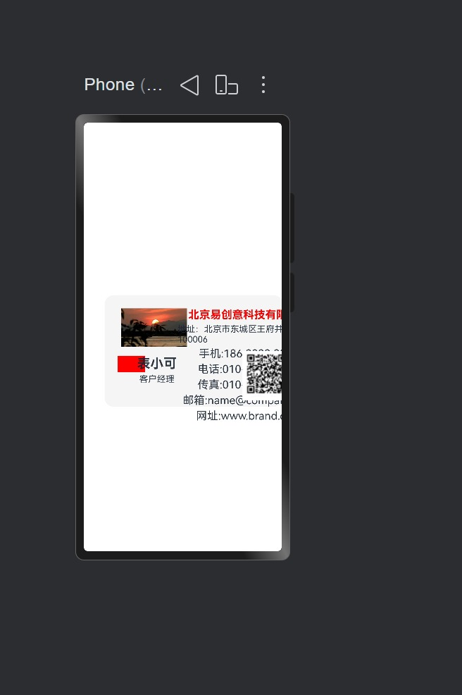
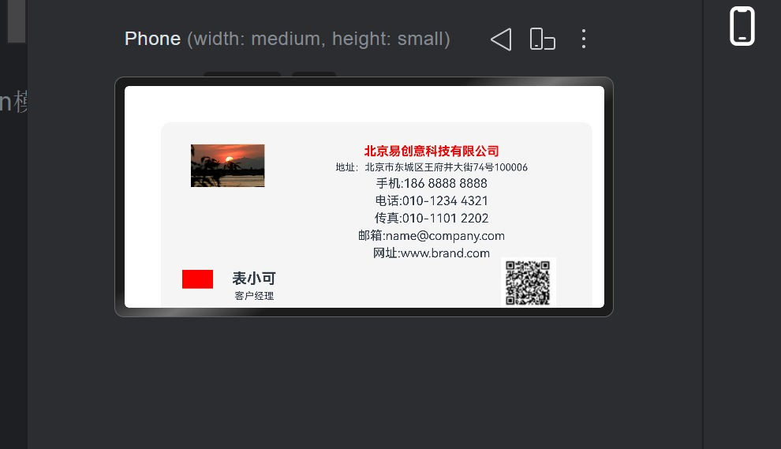
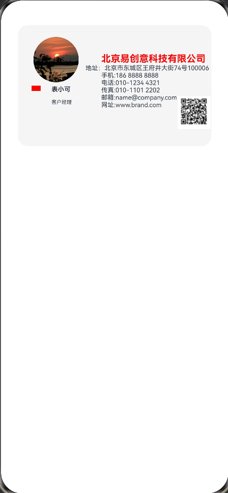

# 鸿蒙学习笔记 （二）：横屏竖屏适配，我踩了三个坑才学会onAreachange
> **日期：** 2026-05-9
## 我遇到的问题
### 名片横屏正常但竖屏乱码





## 第一条路 ：aboutToAppear + 窗口监听
### 代码大概是这样的
```ts
import window from '@ohos.window';//引入window模块，可获得窗口大小位置，监听窗口变化
import common from '@ohos.app.ability.common';
//aboutToAppear 自动执行函数，异步自动跑
  //获取手机窗口的相关信息需询问系统，等待系统返回数据，需要时间，用async和await来表示
  async aboutToAppear() {
    //getLastWindow可能不成功（权限不足或创建窗口失败）需要加入try..catch避免程序崩溃
    //需要要数据的API（await后面的或系统模块里的内容）（要和系统和硬件内容），都有可能失败，需要加入try..catch
    try {
    //获取身份权限(窗口相关信息)
    const context =getContext(this) as common.UIAbilityContext;
  //获取最新的手机窗口
    const win =await window.getLastWindow(context);//旧版本，新版本API需要引入common模块，传入上下文参数context
    //获取手机窗口的坐标，宽度，高度
    const rect =win.getWindowProperties().windowRect;
    //记录更新的数据
    this.screenWidth =rect.width;
    this.screenHeight =rect.height;
    } catch (err){
      console.error("获取失败",err);
      this.screenWidth =1080;
      this.screenHeight =2340;
    }
  }  
```
#### 听AI用aboutToAppear + 窗口监听，但是调试时并没用，还引入生命周期的概念，感觉过度设计了，复杂，不是为布局适配设计做的
## 第二条路 ：getLastWindow/getWindowProperties + 响应式变化
### 代码和第一条路相同，核心问题一样：只在页面创建时获取一次尺寸，旋转屏幕时不会更新
#### 引入了window,common等模块，能跑但是太重，且只能在第一次时获得这个页面的大小，后面进行横屏转的时候，并不能再次获得新的screenwidth荷screenheight,它更适合不同的尺寸类型的设备，比如将这个页面在手机，平板，电脑上展示，会对组件起作用，响应式变化只能获得一次
## 第三条路 ：onAreaChange回调
```ts
 .onAreaChange((oldArea, newArea) => {
      this.screenWidth = px2vp(newArea.width as number)
      this.screenHeight = px2vp(newArea.height as number)
    })
```
#### 用onAreaChange这次运行成功，并且代码整洁了很多，它可以监听组件因布局变化导致的尺寸，位置的改变，需要写在build（）内的最外面的容器上，onAreaChange接受两个参数，oldvalue和newvalue,它和position搭配最好用，虽然现在还不太懂它的底层机制，但知道它任何组件因布局变化导致的尺寸，位置的改变，onAreaChange都会被触发，这是横竖屏适配所需要的
# 最后成果展示




## 核心代码
```ts
@Entry
@Component
struct  PersonTitle{
  @State name :string="表小可"
  @State job : string="客户经理"
  @State company : string="北京易创意科技有限公司"
  @State location : string="北京市东城区王府井大街74号100006"
  @State phone :  string="186 8888 8888"
  @State tel :  string="010-1234 4321"
  @State fax :  string="010-1101 2202"
  @State email : string="name@company.com"
  @State web : string="www.brand.com"
  @State  screenWidth :number =0 //初始窗口宽度为0
  @State screenHeight : number =0//初始窗口高度为0

  build() {
    Column() {//页面背景
      Column(){//壳
        Stack({ alignContent: Alignment.TopStart }) {//内容
          //1.图片
          Image($r('app.media.photo4'))
            .width((this.screenWidth>this.screenHeight ? "20%":"25%"))//百分比竖屏自适应
            .borderRadius("50%")
            .aspectRatio(1)
            .position({left:"5%", top:"5%" })
          //2.红色方框
          Row() {

          }
          .width(this.screenWidth>this.screenHeight ?"10%":"5%") //百分比竖屏自适应
          .aspectRatio(1.7)
          .backgroundColor(Color.Red)
          .position({left:this.screenWidth>this.screenHeight ?'3%':'4%', top: this.screenWidth>this.screenHeight ? '50%':'50%' })
//this.screenWidth>this.screenHeight   宽>高 横屏
          //3.文字
          Column({ space:"3%" }) {
            Text(this.name)
              .fontSize(this.screenWidth > this.screenHeight ? 22:10)
              .fontWeight(700)
              .width(200)
              .maxLines(1)
              .textOverflow({overflow:TextOverflow.Ellipsis})
            Blank(10)
            Text(this.job)
              .fontSize(this.screenWidth > this.screenHeight ? 15:8)
              .width(200)
              .maxLines(1)
              .textOverflow({overflow:TextOverflow.Ellipsis})
          }
          .position({left:'15%', top:'50%' })

          //4.基本信息
          Column({space:"3%"}) {
            Text(this.company)
              .width(300)
              .maxLines(1)
              .textOverflow({overflow:TextOverflow.Ellipsis})
              .fontSize(this.screenWidth > this.screenHeight ? 22:15)
              .fontWeight(700)
              .fontColor(Color.Red)
            //优化lineHeight()适合一个Text内容多到用\n隔开换行使用
            Text('地址：'+this.location).fontSize(this.screenWidth > this.screenHeight ? 22:10)
              .width(350)
              .maxLines(2)
              .textOverflow({overflow:TextOverflow.Ellipsis})
            Text('手机:'+this.phone).fontSize(this.screenWidth > this.screenHeight ? 22:10)
              .width(300)
              .maxLines(1)
              .textOverflow({overflow:TextOverflow.Ellipsis})
            Text('电话:'+this.tel).fontSize(this.screenWidth > this.screenHeight ? 22:10)
              .width(300)
              .maxLines(1)
              .textOverflow({overflow:TextOverflow.Ellipsis})
            Text('传真:'+this.fax).fontSize(this.screenWidth > this.screenHeight ? 22:10)
              .width(300)
              .maxLines(1)
              .textOverflow({overflow:TextOverflow.Ellipsis})
            Text('邮箱:'+this.email).fontSize(this.screenWidth > this.screenHeight ? 22:10)
              .width(300)
              .maxLines(1)
              .textOverflow({overflow:TextOverflow.Ellipsis})
            Text('网址:'+this.web).fontSize(this.screenWidth > this.screenHeight ? 22:10)
              .width(300)
              .maxLines(1)
              .textOverflow({overflow:TextOverflow.Ellipsis})
          }
          .position({left:this.screenWidth>this.screenHeight ?'35%':'45%', top: '20%'})

          //5.二维码
          Image($r('app.media.qrcode'))
            .width("18%")
            .aspectRatio(1)
            .position({left:this.screenWidth>this.screenHeight ? '83%':'85%', top:this.screenWidth>this.screenHeight ? '40%':'60%' })
        }
          .width("100%")
          .height("100%")
          .padding(10)
          .borderRadius(16)
          .backgroundColor("#f5f5f5")
      }
      .width(this.screenWidth>this.screenHeight? "95%":"85%")//卡片占屏幕90%
      .aspectRatio(1.6)//宽高比1.6：1
      .shadow({radius:10,color: '#00000020',offsetX:0,offsetY:0})

    }
    .justifyContent(FlexAlign.Start)
    .width("100%")
    .height("100%")
    .onAreaChange((oldArea, newArea) => {
      this.screenWidth = px2vp(newArea.width as number)
      this.screenHeight = px2vp(newArea.height as number)
    })
}
}
```

### 学到的知识
- 字体省略
  1. 设置规定的行数和组件大小 .maxLines() .width() 
  2. 设置字体省略 .textOverflow({overflow :TextOverflow.Ellipsis})
- 图像变圆形 
  1. 先变成正方形 .aspectRatio(1) 
  2. borderRadius(宽度的一半)
- 阴影使用
  1. .shadow({radius:10,color:'#00000020',offsetX:0,offsetY:4})
  2. 阴影要用在卡片上
### 学习心得
  1. AI的建议要判断，多提问
  2. onAreaChange适用布局适配
  3. 时间会消耗热情，唯有坚持
### 下一步
- 学习看板建造
- 基于health kit写一个健康看板app
